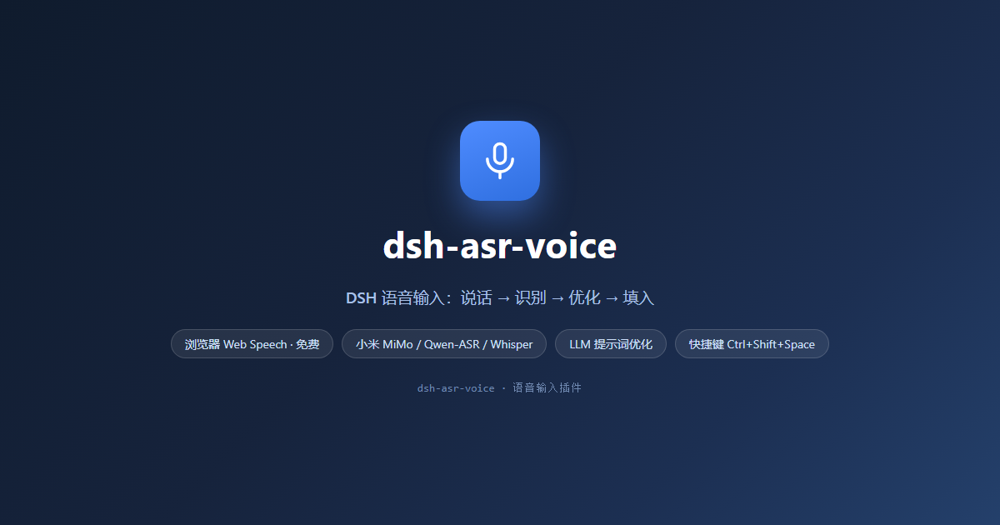
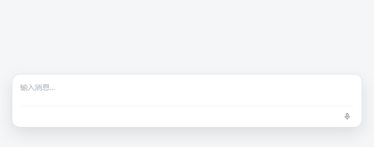
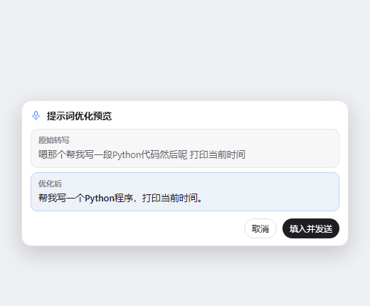

# dsh-asr-voice（语音输入）

<p align="center">
  
</p>

DeepSeek Harness（DSH）语音输入插件：**说话 → 识别 → 提示词优化 → 填入/发送**，
体验类似 Codex 语音输入。对着麦克风说出想法，插件把口语转成干净、可直接发送的提示词。

- **混合 ASR 引擎**（默认 `auto`）：浏览器 Web Speech 优先（免费、免 key、Chrome/Edge 双平台）；
  不可用或被网络屏蔽时（如国内无法访问 Google 识别服务）**自动回落**到已配置的云端 ASR。
  云端支持**多供应商**（可同时保存小米 MiMo / OpenAI / Groq / 硅基流动 / 通义 Qwen-ASR 的
  key，设置页切换当前使用，并按需「获取模型」动态拉取各供应商最新 ASR 模型）
- **提示词优化**：默认用**当前所选 LLM** 重写（走官方 LLM 通道，无需单独配 key）；可选本地启发式（免费离线）
- **隐私友好**：API key 只存本机服务端（host settings），浏览器只经 `/api/asr-voice/*` 私有 JSON
  代理调用，key 不进前端；录音在浏览器本地完成格式转换后再上传
- **顺手的细节**：识别结果可一键复制到剪贴板（默认开）、选择「完整替换」或「末尾追加」到草稿
- **零第三方依赖**：运行时只依赖官方 `@deepseek-ai/*` peer 包，可单独用、可组合用

## 功能

- 输入框工具行**麦克风按钮**（`conversation.input.right`）：点击开始/结束，静音自动停止，可选按住说话
- 默认快捷键 **Ctrl+Shift+Space**（可配置，支持 macOS 的 Cmd 兼容）
- 识别后**提示词优化**：默认用当前所选 LLM 重写（预览「原始 → 优化」后确认）；可切换本地启发式（清洗语气词/补标点/分段，即时填入）
- 识别后**填入草稿**待确认；可选「识别后自动发送」（push-to-talk 风格）
- 设置卡片：「设置 → 插件 → 配置 → 语音输入」

## 效果

<video src="docs/video-mute.mp4" width="720" controls loop muted></video>

| 输入框麦克风按钮 | 录音中（红色扩散 + 实时频谱） | LLM 优化预览 |
| --- | --- | --- |
|  |  |  |

## 安装

```sh
dsh plugin --profile <profile> add <本插件路径或 GitHub 仓库>
```

浏览器端依赖官方 client 包（由 DSH 提供），无需额外安装。

## 设置项（namespace `asr-voice`）

| 分组 | 字段 | 默认 | 说明 |
|---|---|---|---|
| 识别引擎 | `asr.provider` | `auto` | `auto`（浏览器 Web Speech 优先，失败自动切云端）/ `browser`（Web Speech）/ `cloud`（OpenAI-compatible） |
| 云端 | `asr.cloud.providers` | `[]` | **多供应商列表**：每个含 `{id, preset, baseUrl, apiKey, model, mode}`，可保存多个服务商 key |
| 云端 | `asr.cloud.active` | 空 | 当前使用的供应商 id（空 = 取第一个）；设置页可切换 |
| 云端 | `asr.cloud.preset` | `openai` | `openai` / `groq` / `siliconflow` / `mimo` / `dashscope` / `custom` |
| 云端 | `asr.cloud.baseUrl` | 预置自动填 | 任意 OpenAI-compatible base URL |
| 云端 | `asr.cloud.apiKey` | 空 | 仅存本机服务端；MiMo 端点留空时自动复用 DSH 凭据 `MIMO_API_KEY` |
| 云端 | `asr.cloud.model` | 预置自动填 | 如 `whisper-1` / `whisper-large-v3` / `FunAudioLLM/SenseVoiceSmall` / `mimo-v2.5-asr` / `qwen3-asr-flash`；设置页可「获取模型」动态拉取该供应商最新 ASR 模型 |
| 云端 | `asr.cloud.mode` | `auto` | `auto`（按模型名判定）/ `transcriptions`（whisper 式）/ `chat`（MiMo/Qwen-ASR） |
| 优化 | `optimize.mode` | `llm` | `llm`（默认，用当前所选 LLM 重写）/ `heuristic`（本地启发式） |
| 优化 | `optimize.llm.provider` / `.model` | 空 | 可选：从 **DSH 已配置模型列表**指定；留空则用当前所选 LLM。自定义须先到 DSH 模型列表添加 |
| 语言 | `language` | `auto` | `auto` / `zh-CN` / `en-US` |
| 行为 | `behavior.autoSend` | `false` | 识别后自动发送 |
| 行为 | `behavior.holdToTalk` | `false` | 按住快捷键说话、松开结束 |
| 行为 | `behavior.textMode` | `replace` | 文本输入模式：`replace`（完整替换草稿）/ `append`（在已有文字后追加） |
| 行为 | `behavior.copyToClipboard` | `true` | 识别/优化后自动把结果复制到剪贴板 |
| 行为 | `behavior.hotkey` | `Ctrl+Shift+Space` | 快捷键（空 = 关闭） |
| 统计 | `/api/asr-voice/stats` | — | ASR 用量统计（次数/字符/最近时间，进程内） |

## 云端 ASR 预置

| 预置 | baseUrl | 默认模型 | 通道 |
|---|---|---|---|
| OpenAI | `https://api.openai.com/v1` | `whisper-1` | whisper 式 `/audio/transcriptions` |
| Groq | `https://api.groq.com/openai/v1` | `whisper-large-v3` | whisper 式 `/audio/transcriptions` |
| 硅基流动 SiliconFlow | `https://api.siliconflow.cn/v1` | `FunAudioLLM/SenseVoiceSmall` | whisper 式 `/audio/transcriptions` |
| 小米 MiMo | `https://api.xiaomimimo.com/v1` | `mimo-v2.5-asr` | chat + `input_audio`（key 可复用 DSH 凭据 `MIMO_API_KEY`） |
| 通义/阿里云百炼 Qwen-ASR | `https://dashscope.aliyuncs.com/compatible-mode/v1` | `qwen3-asr-flash` | chat + `input_audio` |

两条调用通道（设置项 `asr.cloud.mode`，默认 `auto`）：
- **whisper 式** `transcriptions`：multipart 上传到 `/audio/transcriptions`（OpenAI / Groq / 硅基流动 / 本地部署）。
- **chat + input_audio** `chat`：base64 data URI 走 `/chat/completions`——小米 MiMo-V2.5-ASR、通义 Qwen-ASR 等音频大模型的 OpenAI 兼容姿势。
- **auto**：按模型名自动判定（模型名含 `asr`/`audio`/`omni`/`sensevoice` 走 chat，否则 whisper 式）。

自定义端点兼容任何 OpenAI-compatible 服务（按模型选对应通道）。

## 外部依赖

- 浏览器：Web Speech API（Chrome/Edge；Safari 部分支持）、`getUserMedia` + `MediaRecorder`
- 云端 ASR / LLM：你配置的 OpenAI-compatible 服务（网络请求由本机 host 发起）
- 运行时**不依赖任何第三方 DSH 插件**（与 dsh-ui-tweaks 等完全独立，可单独用、可组合用）

## 生命周期脚本

**无** `preinstall` / `install` / `postinstall` / `prepare` 等安装期脚本；
`build` / `build:client` / `bundle` / `typecheck` 仅开发者构建用，不参与安装。

## 权限与已知风险（保守披露）

| 权限 | 等级 | 说明 |
|---|---|---|
| 麦克风 | 高 | 浏览器 `getUserMedia` 需要用户授权；录音仅在点击/快捷键触发时进行 |
| 网络 | 中 | 云端 ASR/LLM 时，本机 host 向**你配置的** baseUrl 发起 HTTPS 请求 |
| 设置读写 | 中 | 读写自有 namespace `asr-voice`（含 API key，仅存本机服务端） |
| 文件/命令/凭据 | 无 | 不访问文件系统、不执行命令、不读取其他凭据 |

已知风险：
- 浏览器 Web Speech 在 Firefox 不可用（提示改用云端）；识别质量取决于浏览器/服务商。
- 云端转写会把你的语音上传到所配置的服务商，请确认其隐私政策。
- API key 明文存于本机 DSH settings；仅本机回环可访问代理路由（信任围栏防 CSRF）。
- 动效为**自研 GSAP 风格轻量动画模块**（离线构建环境无 gsap 包可装），API 对齐 GSAP
  （`to`/`fromTo`/`timeline`），后续可一行替换为真 GSAP——不影响组件调用点。

## 开发

- 构建：`bash scripts/build.sh`（自动选用 Node ≥18；依赖树经 junction 链接到已装兄弟插件
  或 `DSH_CHECKOUT`，**仅为构建期**便利，与运行时无关）
- 类型检查：`node_modules/.bin/tsc -p tsconfig.host.json --noEmit && node_modules/.bin/tsc -p tsconfig.client.json --noEmit`
- 契约：本仓库 AGENTS.md 指向伞仓库 `dsh-plugins/AGENTS.md`（单一来源）

## License

MIT
